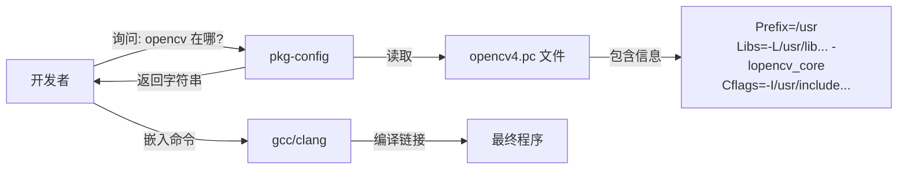

# C++ 编译与链接系统架构说明书 (v1.0)

**文档版本**: 1.0  
**适用平台**: Linux (Debian/Ubuntu系, 特别是 aarch64 多架构环境)  
**最后更新**: 2026-04-15  
**作者**: Qwen3.6-Plus

---

## 📖 前言：阅读指南

本手册旨在帮助开发者理解 Linux 下 C++ 开发的底层文件系统结构、编译工具链原理以及依赖管理机制。我们将通过以下隐喻来构建知识体系：

*   **头文件 (`.h`/`.hpp`) = 【产品说明书】**：告诉编译器“有什么功能”、“怎么用”，但不包含具体实现。
*   **运行库 (`.so`/`.a`) = 【核心工具/零件】**：包含具体的二进制代码，是程序运行时真正调用的“工具”。
*   **编译器 (gcc/g++) = 【组装车间】**负责将源代码和说明书结合，生成机器码。
*   **链接器 (ld) = 【物流调度】**：负责在最终的 executable 中把需要的“工具”找齐并打包。
*   **pkg-config/CMake = 【智能采购员】**：自动帮你查找说明书和工具的位置，避免手动硬编码路径。

---

## 第一章：基础要素——C++ 编译的基本过程

在深入目录结构之前，必须理解一个 `.cpp` 文件是如何变成可执行程序的。这个过程分为四个阶段，每个阶段处理不同的“物料”。

### 1.1 编译四部曲

| 阶段                          | 输入            | 输出  | 动作描述                                                 | 关键角色   |
| :---------------------------- | :-------------- | :---- | :------------------------------------------------------- | :--------- |
| **1. 预处理** (Preprocessing) | `.cpp`          | `.i`  | 展开 `#include`（插入说明书内容），替换宏定义。          | 预处理器   |
| **2. 编译** (Compilation)     | `.i`            | `.s`  | 检查语法，将代码翻译成汇编语言。                         | 编译器前端 |
| **3. 汇编** (Assembly)        | `.s`            | `.o`  | 将汇编代码转换成机器指令（目标文件）。                   | 汇编器     |
| **4. 链接** (Linking)         | `.o` + `.so/.a` | `exe` | 将多个目标文件和外部库（工具）连接在一起，解析符号引用。 | 链接器     |

### 1.2 为什么需要区分“说明书”和“工具”？

*   **编译期**只需要**说明书**（头文件）。编译器只要知道 `void print();` 存在即可，不需要知道它内部是怎么写的。
*   **链接期/运行期**才需要**工具**（库文件）。 linker 需要找到 `print` 函数的具体二进制代码放在哪里。

> **常见错误根源**：
> *   `fatal error: xxx.h: No such file or directory` -> **找不到说明书**（缺少 `-I` 路径）。
> *   `undefined reference to 'xxx'` -> **找不到工具**（缺少 `-L` 路径或 `-l` 库名）。

---

## 第二章：仓库管理——Linux 库文件目录详解

在 Linux 中，“工具”（库文件）存放在特定的仓库目录中。理解这些目录的区别，是解决“链接错误”的关键。

### 2.1 三大核心库目录对比

| 目录路径                          | 隐喻角色              | 来源与管理                                       | 架构特性                                                   | 优先级/备注                                                  |
| :-------------------------------- | :-------------------- | :----------------------------------------------- | :--------------------------------------------------------- | :----------------------------------------------------------- |
| **`/usr/lib/aarch64-linux-gnu/`** | **官方标准零件库**    | 系统包管理器 (`apt`) 安装。由 OS 维护。          | **严格绑定 aarch64**。多架构系统专用。                     | **现代 Debian/Ubuntu 的标准位置**。编译器默认优先搜索此处。  |
| **`/usr/lib/`**                   | **通用兼容区/旧仓库** | 系统包管理器安装。                               | 可能是符号链接，指向架构特定目录；或存放无架构差异的文件。 | 为了兼容性保留。在现代系统中，很多文件是指向 `.../aarch64-linux-gnu/` 的软链接。 |
| **`/usr/local/lib/`**             | **手工定制车间**      | 用户手动编译 (`make install`) 或第三方脚本安装。 | 对应当前系统架构。                                         | **优先级通常高于 `/usr/lib`**。用于存放新版库或自定义修改版，避免覆盖系统自带库。 |

pkgconfig这个文件夹在这三个主要的库文件夹目录下面，pkgconfig文件夹里面包含各个软件包的头文件和链接库路径，如果编译程序找不到，可能是这里出错了。

### 2.2 深度解析：为什么会有 `/usr/lib/aarch64-linux-gnu`？

这是 **Multi-Arch (多架构)** 支持的核心体现。
*   **问题**：如果在同一台机器上既要运行 ARM64 程序，又要交叉编译或运行 x86 兼容程序，它们的 `libc.so` 名字一样但内容完全不同。如果都放在 `/usr/lib`，会互相覆盖。
*   **解决**：Debian/Ubuntu 引入架构子目录。
    *   ARM64 的库 -> `/usr/lib/aarch64-linux-gnu/`
    *   x86_64 的库 -> `/usr/lib/x86_64-linux-gnu/`
*   **编译器智慧**：`gcc` 在 aarch64 机器上运行时，会自动默认搜索 `aarch64-linux-gnu` 子目录，无需手动指定 `-L`。

### 2.3 最佳实践原则

1.  **不要手动触碰** `/usr/lib` 或 `/usr/lib/aarch64-linux-gnu`。这是系统的禁地，手动修改可能导致 `apt upgrade` 失败或系统崩溃。
2.  **手动安装的库** 应进入 `/usr/local/lib`。
3.  **如果手动安装后程序找不到库**：
    *   运行 `sudo ldconfig` 更新缓存。
    *   或者在 `/etc/ld.so.conf.d/` 下新建配置文件指向你的库路径。

---

## 第三章：资产中心——`/usr/share` 的作用

你可能会问：“既然前三个都是放‘工具’（二进制库）的，那 `/usr/share` 是干什么的？”

### 3.1 定义：架构无关的共享数据

如果说 `/usr/lib` 是**引擎零件**（给机器跑，分车型/架构），那么 `/usr/share` 就是**说明书、贴纸和内饰图**（给人看，所有车型通用）。

*   **特点**：**Architecture-Independent**（架构无关）。无论是 ARM 还是 Intel CPU，这些文件的内容完全一致，不需要重新编译。
*   **内容示例**：
    *   `/usr/share/man/`：帮助手册（`man` 命令读取）。
    *   `/usr/share/doc/`：README, LICENSE, Changelog。
    *   `/usr/share/icons/`：应用程序图标。
    *   `/usr/share/locale/`：多语言翻译文件（`.mo`）。
    *   `/usr/share/pkgconfig/`：**重点！** 存放 `.pc` 元数据文件（文本格式，非二进制）。

### 3.2 为什么分离？

1.  **节省带宽与存储**：在多架构服务器或交叉编译环境中，二进制库（`/usr/lib`）需要为每种架构下载一份，但文档和资源（`/usr/share`）只需共享一份。
2.  **安全性**：`/usr/share` 通常可以挂载为只读，因为它不包含可执行代码，不会被注入恶意二进制指令。

---

## 第四章：智能采购员——pkg-config 与构建系统

手动告诉编译器去哪里找“说明书”（`-I`）和“工具”（`-L`, `-l`）是非常痛苦且容易出错的。**pkg-config** 应运而生。

### 4.1 pkg-config 是什么？

它是一个命令行辅助工具，充当**“图书馆索引员”**。
*   它不直接编译代码。
*   它读取 `.pc` 文件（位于 `/usr/lib/.../pkgconfig/` 或 `/usr/share/pkgconfig/`）。
*   它输出标准的编译器标志。

### 4.2 工作原理图解



### 4.3 常用命令

```bash
# 1. 获取编译标志（头文件路径 -I）
pkg-config --cflags opencv4

# 2. 获取链接标志（库路径 -L 和 库名 -l）
pkg-config --libs opencv4

# 3. 一站式获取（最常用）
g++ main.cpp $(pkg-config --cflags --libs opencv4) -o my_app

# 4. 检查库是否存在
pkg-config --exists opencv4 && echo "Found" || echo "Not Found"
```

### 4.4 常见问题：为什么 pkg-config 找不到库？

**场景**：你手动编译安装了库到 `/usr/local`，但 `pkg-config` 报错 `Package xxx was not found`。

**原因**：`pkg-config` 默认只搜索系统标准路径（如 `/usr/lib/pkgconfig`），不知道你去 `/usr/local` 看了。

**解决方案**：设置环境变量 `PKG_CONFIG_PATH`。

```bash
# 临时生效
export PKG_CONFIG_PATH=/usr/local/lib/pkgconfig:$PKG_CONFIG_PATH

# 永久生效 (写入 ~/.bashrc)
echo 'export PKG_CONFIG_PATH=/usr/local/lib/pkgconfig:$PKG_CONFIG_PATH' >> ~/.bashrc
source ~/.bashrc
```

---

## 第五章：进阶——为什么 CMake 比 pkg-config 更“聪明”？

在实际开发中，你可能发现直接用 `pkg-config` 会失败，但用 CMake 的 `find_package(OpenCV)` 却能成功。为什么？

### 5.1 机制对比

| 特性           | pkg-config                                             | CMake (`find_package`)                                       |
| :------------- | :----------------------------------------------------- | :----------------------------------------------------------- |
| **依赖源**     | 仅依赖 `.pc` 文件。                                    | 1. Config 模式 (`.cmake` 文件)<br>2. Module 模式 (内置脚本)<br>3. Fallback 到 pkg-config |
| **路径灵活性** | 僵化。`.pc` 里写死 `/usr/local`，它就信 `/usr/local`。 | 灵活。会尝试多个常见路径，甚至扫描文件系统。                 |
| **错误处理**   | 找不到就报错。                                         | 有复杂的 fallback 逻辑，能自动修正某些发行版的路径偏差。     |
| **适用场景**   | 简单的 Makefile，轻量级构建。                          | 大型项目，复杂依赖关系，跨平台构建。                         |

### 5.2 案例解析：OpenCV 的路径陷阱

*   **现象**：
    *   `pkg-config --cflags opencv4` 返回 `-I/usr/local/include/opencv4`。
    *   但实际文件在 `/usr/include/opencv4`（因为你是 apt 安装的）。
    *   **结果**：手动编译报错，因为 `/usr/local` 下没文件。
*   **CMake 为何成功**：
    *   CMake 首先寻找 `OpenCVConfig.cmake`。这个文件是由 OpenCV 安装包生成的，里面记录了**安装时的真实路径**。
    *   即使 `.pc` 文件过时或错误，CMake 通过 Config 模式绕过了它，直接读取了正确的绝对路径。

### 5.3 建议

1.  **小型项目/学习**：使用 `pkg-config`，简单直接，理解底层原理。
2.  **大型项目/生产环境**：使用 **CMake** 或 **Meson**。它们封装了复杂性，提供了更好的跨平台支持和依赖管理。
3.  **调试技巧**：如果 CMake 找不到库，尝试删除 `build` 目录重新配置，或检查 `CMAKE_PREFIX_PATH`。

---

## 附录：快速排查清单 (Troubleshooting)

当你遇到编译问题时，请按以下步骤检查：

1.  **报错：`xxx.h: No such file or directory`**
    *   [ ] 检查是否安装了 `-dev` 包（如 `libopencv-dev`）。头文件通常在 dev 包里。
    *   [ ] 运行 `pkg-config --cflags <lib>` 看是否有输出。
    *   [ ] 如果没有，检查 `PKG_CONFIG_PATH`。

2.  **报错：`undefined reference to 'xxx'`**
    *   [ ] 检查是否链接了库：`pkg-config --libs <lib>`。
    *   [ ] 检查库文件是否存在：`ls /usr/lib/aarch64-linux-gnu/libxxx.so*`。
    *   [ ] 如果是手动安装的库，运行 `sudo ldconfig`。

3.  **报错：`error while loading shared libraries: libxxx.so: cannot open shared object file`** (运行时错误)
    *   [ ] 运行 `ldd ./your_program` 查看哪个库显示 `not found`。
    *   [ ] 检查 `/etc/ld.so.cache` 是否包含该库路径。
    *   [ ] 运行 `sudo ldconfig` 刷新缓存。

---

**结语**：
理解 Linux 的文件系统层次结构（FHS）和编译链接原理，是从“复制粘贴代码”进阶到“系统级开发”的关键一步。记住：**头文件是说明书，库文件是工具，pkg-config 是索引，CMake 是全能管家。**